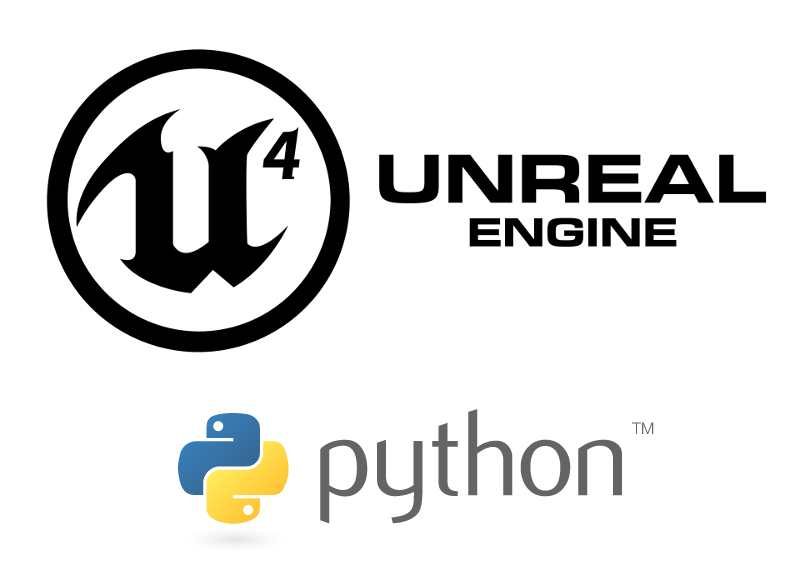

.. include:: <s5defs.txt>

===========================
Python in Unreal Engine 4
===========================

.. This document is taken from https://github.com/Parsely/python-nlp-slides
.. and used as a template

.. container:: handout

    **How this was made**

    This document was created using Docutils_/reStructuredText_ and S5_.

    source_

.. _source: https://github.com/Pulecz/presentations
.. _Docutils: http://docutils.sourceforge.net/
.. _reStructuredText: http://docutils.sourceforge.net/rst.html
.. _S5: http://meyerweb.com/eric/tools/s5/

What is it?
---------------
.. _UnrealEnginePython: https://github.com/20tab/UnrealEnginePython

what README.md says:

UnrealEnginePython_ is a plugin embedding whole Python VM (both 3 and 2) to UE4

- free open source plugin you can add to any C++ UE4 Project

- tries to give easy access to all of the UE4 internal api + its reflection system

- automating tasks

- unit tests

- implement gameplay elements

- not meant as a way to avoid blueprints or c++ but as a good companion to them

- currently supported Unreal Engine versions are 4.12, 4.13, 4.14, 4.15 and 4.16

- works on Linux, Mac, Windows

What are blueprints and C++ in UE4?
-----------------------------------

- Blueprints - visual programing, node based interface

- C++ for writing new gameplay classes and exposing interface for blueprints

Working with it
---------------

Adds classes:
  - actor class (PyActor)
  - pawn class (PyPawn)
  - character class (PyCharacter)
  - component class (PythonComponent)

then link to script

many more

Showcase
--------

hopefully

Conclusion
----------

Questions?

git_ github.com/Pulecz

.. _git: https://github.com/Pulecz/
