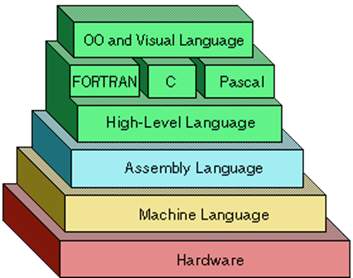

.. include:: <s5defs.txt>

===========================
Python in Unreal Engine 4
===========================

.. image:: img/python-logo-master-v3-TM.png
            :align: center

.. This document is taken from https://github.com/Parsely/python-nlp-slides
.. and used as a template

.. container:: handout

    **How this was made**

    This document was created using Docutils_/reStructuredText_ and S5_.

    source_

.. _source: https://github.com/Pulecz/presentations
.. _Docutils: http://docutils.sourceforge.net/
.. _reStructuredText: http://docutils.sourceforge.net/rst.html
.. _S5: http://meyerweb.com/eric/tools/s5/

What is Python?
---------------

- A widely used high-level programming language for general-purpose programming
- Open source and community based development model
- Created in 1990 by Guido van Rossum and named after Monty Python

.. image:: img/python-logo.png

Why Python?
-----------
.. class:: incremental

  - Beginner Friendly

    - Python was designed to be easy to understand and fun to use

    - High level language, which reads like English

    - Handles a lot of complexity for you

    - Very Flexible - no hard rules to follow

  - Highly portable

    - Runs almost anywhere

  - Community

    - Popular and discussed language, PyCons all over the world

  - Future

    - Open source project - lots of people contributing

    - Latest version is Python 3.6.0 with thousands of modules

Design Philosophy
-----------------

.. image:: img/xkcd_python.png
            :align: left

Design Philosophy
-----------------

.. sourcecode:: python

    >>> import this
    The Zen of Python, by Tim Peters

.. sourcecode:: plain

    Beautiful is better than ugly.
    Explicit is better than implicit.
    Simple is better than complex.
    Complex is better than complicated.
    Flat is better than nested.
    Sparse is better than dense.
    Readability counts.
    Special cases aren't special enough to break the rules.
    Although practicality beats purity.
    Errors should never pass silently.
    Unless explicitly silenced.

Design Philosophy
-----------------

.. sourcecode:: plain

    In the face of ambiguity, refuse the temptation to guess.
    There should be one-- and preferably only one --obvious way to do it.
    Although that way may not be obvious at first unless you're Dutch.
    Now is better than never.
    Although never is often better than *right* now.
    If the implementation is hard to explain, it's a bad idea.
    If the implementation is easy to explain, it may be a good idea.
    Namespaces are one honking great idea -- let's do more of those!

The pyramid
-----------

The pyramid
-----------

Don't reinvent the wheel

PyPI - the Python Package Index

02.03.2016 - 99851 packages

https://pypi.python.org/pypi

Popularity
----------
.. class:: incremental

  .. image:: img/pypl.png
              :align: right

  http://pypl.github.io/PYPL.html

Differences
-----------

C Hello World

.. sourcecode:: c

  #include

  int main(void)
  {
      puts("Hello, world!");
  }

Java Hello World

.. sourcecode:: java

  public class HelloWorld {
     public static void main(String[] args) {
        // Prints "Hello, World" in the terminal window.
        System.out.println("Hello, World");
     }
  }

Differences
-----------

Python3

.. sourcecode:: python

  print("Hello, world!")

More Java Differences

http://www.programcreek.com/2012/04/java-vs-python-why-python-can-be-more-productive/

Ruby, JavaScript and some more languages are somewhat similar

Python VS ES6 syntax comparison:

https://gist.github.com/revolunet/537a3448cff850231a74

What is it used for?
--------------------
.. class:: incremental

check https://www.python.org/about/success/

- Rapid Prototyping

- Throw-away, Ad hoc Programming

- Scientific Applications

- Extension language

- Backend Web

- XML processing

- Database applications

- GUI applications

- A Glue Language

Practice!
---------

Either type more now, type less later:

.. sourcecode:: bash

  cd python-root
  cd skoleni-python
  source bin/activate
  jupyter notebook

Or run:

.. sourcecode:: bash

  ipython

and type a lot

Next: Python 02
---------------

10.3.

- More basics
- Functions
- More pratice
- First real "program"
