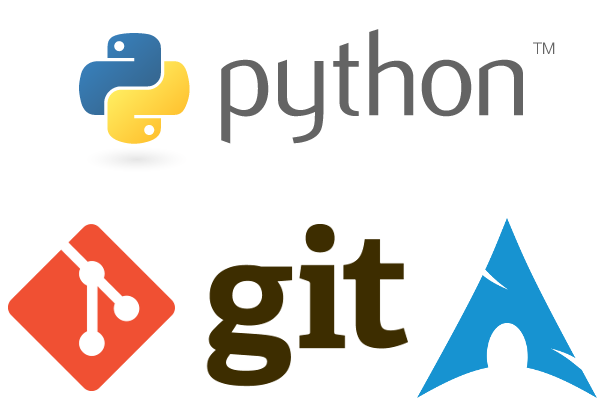
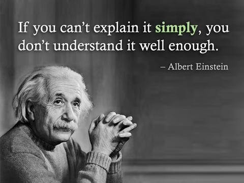

.. include:: <s5defs.txt>

======================================
Experiences teaching (not only) Python
======================================

.. This document is taken from https://github.com/Parsely/python-nlp-slides
.. and used as a template

.. container:: handout

    **How this was made**

    This document was created using Docutils_/reStructuredText_ and S5_.

    source_

.. _source: https://github.com/Pulecz/presentations
.. _Docutils: http://docutils.sourceforge.net/
.. _reStructuredText: http://docutils.sourceforge.net/rst.html
.. _S5: http://meyerweb.com/eric/tools/s5/

About Me
---------------

- using Python since 2013 with gaps
- gamer
- job in IBM

Why did I start?
----------------

.. class:: incremental

- On High School

  - I recalled that specific school lacked proper IT classes

  - so I wanted to give back my knowledge to young students

  - so they can start soon, while they still have time

- In Work

  - lots of people doing work in unnecessarily complex way

  - they have no idea how easy can it really be

  - let's try to teach them, so they at least have an idea that its possible

- In general, knowing how to use Python is a useful skill

Why Python?
-----------
.. class:: incremental

  - Beginner Friendly

    - Python was designed to be easy to understand and fun to use

  - Large area of application

    - automate boring stuff

    - web development

    - ...

  - Highly portable

    - runs almost anywhere

  - Community

    - popular and discussed language, PyCons all over the world

  - Future

    - open source project - lots of people contributing

    - latest version is Python 3.6.0 with lots of powerful modules

Can I teach?
------------

High school
-----------

.. class:: incremental

- small school only few students interested at first

- started in February, one day in week, 90 minutes after they finished regular classes

- students have experience with PHP, HTML, CSS and JavaScript

- testing grounds

- used material that root.cz courses uses

- "monkey see monkey do" approach versus time

- homeworks, books

- one hour about Arch Linux and another about git

In work
-------

.. class:: incremental

- only one Python course happened in 2016

- high demand for it

- targeted complete beginners

- tesing course, 4 hours every Friday for 6 weeks

- preparing for larger courses now

Common Issues
-------------

.. class:: incremental

- Technical

  - Windows, Mac, number of Linux distrubutions - everybody has different version

  - school and work limitations, is it allowed?..

- People

  - different skills

  - motivation, project in mind?

  - continue learning their free time

  - building common vocabulary

Improvements
------------

.. class:: incremental

- VirtualBox and Arch Linux image with prepared software

  - ipython
  - jupyter notebook
  - etc.

- let students study materials before

- after having some basic skills, practice, practice, practice (if there is time)

- final evaluation - a project

Conclusion
----------

Questions?

git_ github.com/Pulecz

.. _git: https://github.com/Pulecz/
